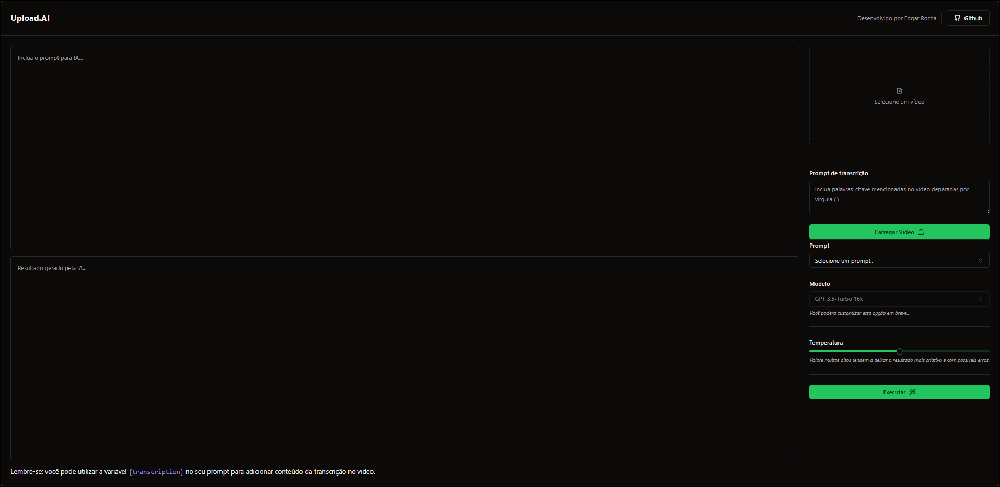

<h1 align="center"> Upload-AI-Server </h1>

  <a href="#-tecnologias">Tecnologias</a>&nbsp;&nbsp;&nbsp;|&nbsp;&nbsp;&nbsp;
  <a href="#-projeto">Projeto</a>&nbsp;&nbsp;&nbsp;|&nbsp;&nbsp;&nbsp;
  <a href="#memo-licença">Licença</a>

  

 

  

## 🚀 Tecnologias

Esse projeto foi desenvolvido com as seguintes tecnologias:

- React
- Typescript
- Node.js
- Prisma
- Web Assembly
- FFMPEG
- Zod
- Shadcn
- Tailwind CSS

## 💻 Projeto

O Upload-AI é uma aplicação que permite ao usuário realizar descrição e títulos para videos utilizados o modelos de IA da Open AI Whisper e ChatGPT.

## :memo: Licença

Esse projeto está sob a licença MIT.
